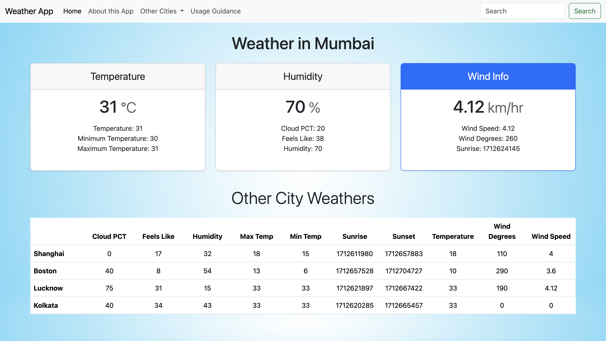
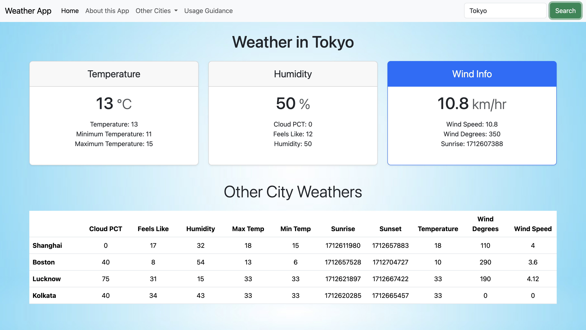

# My Weather App

This is a simple weather application that allows users to search for weather information of a specific city and view weather data for other cities as well. The project uses the Weather by API-Ninjas API from RapidAPI to fetch weather data.

## Technologies Used

- HTML
- CSS (Bootstrap)
- JavaScript

## API Used

- **Weather by API-Ninjas**: This API provides weather information for various locations. It is used to fetch weather data based on the user's input city.

You can find more information about the API and its endpoints [here](https://rapidapi.com/apininjas/api/weather-by-api-ninjas/).

## Screenshots

<!-- Add screenshots of your application here -->
<!-- Example: -->
1]

2]

## How to Run

1. Clone this repository to your local machine.
2. Open `index.html` in a web browser.

## Credits

- Weather by API-Ninjas API: [RapidAPI](https://rapidapi.com/apininjas/api/weather-by-api-ninjas/)
